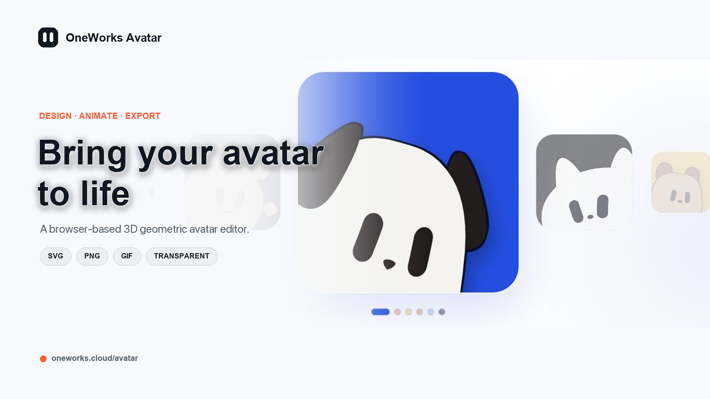

# OneWorks Avatar

[English](README.md) | [简体中文](README.zh-Hans.md)

<picture>
  <source media="(prefers-color-scheme: dark)" srcset=".github/assets/avatar-cover-dark-en.jpg">
  <source media="(prefers-color-scheme: light)" srcset=".github/assets/avatar-cover-light-en.jpg">
  
</picture>

Create, animate, and export a geometric 3D avatar directly in your browser.

## Quick start

1. Open [oneworks.cloud/avatar](https://oneworks.cloud/avatar/).
2. Choose an avatar and customize its pose, materials, face, camera, and animation.
3. Open the camera menu to copy SVG or download SVG, PNG, or animated GIF. Choose a transparent camera background when you need alpha.

## Agent Skill

Install the `oneworks-avatar` skill to let an AI agent work with the real editor and its 3D scene model:

```bash
npx skills@latest add oneworks-ai/avatar
```

## Documentation

See the [complete Avatar guide](https://oneworks.cloud/docs/en/usage/avatar) for export behavior, developer integration, runtime boundaries, local development, and deployment.
