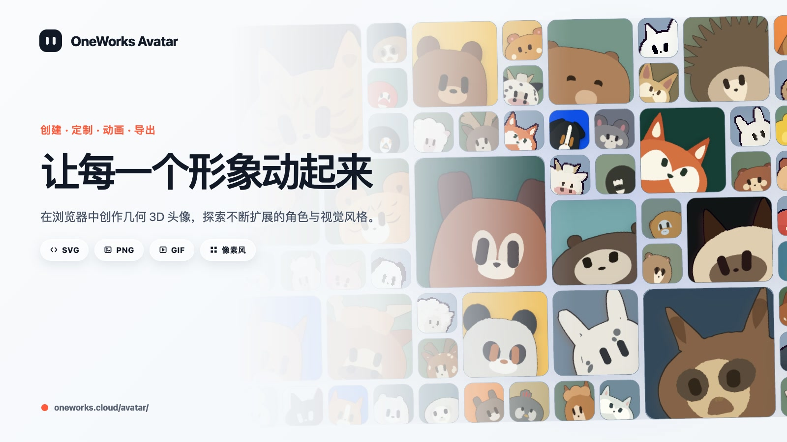

# OneWorks Avatar

[English](README.md) | [简体中文](README.zh-Hans.md)

<picture>
  <source media="(prefers-color-scheme: dark)" srcset=".github/assets/avatar-cover-dark-zh-Hans.jpg">
  <source media="(prefers-color-scheme: light)" srcset=".github/assets/avatar-cover-light-zh-Hans.jpg">
  
</picture>

此封面会自动跟随系统的浅色或深色配色方案。

直接在浏览器中创建、制作动画并导出几何 3D 头像。

## 快速开始

1. 打开 [oneworks.cloud/avatar](https://oneworks.cloud/avatar/)。
2. 选择形象，调整姿态、材质、表情、相机和动画。
3. 打开相机菜单，即可复制 SVG，或下载 SVG、PNG 和动画 GIF；需要 Alpha 通道时，将相机背景设为透明。

## Agent Skill

安装 `oneworks-avatar` Skill，让 AI Agent 通过真实编辑器及其 3D 场景模型完成头像工作：

```bash
npx skills@latest add oneworks-ai/avatar
```

## 完整文档

导出行为、开发者接入、Runtime 边界、本地开发和部署说明见 [Avatar 完整指南](https://oneworks.cloud/docs/usage/avatar)。
